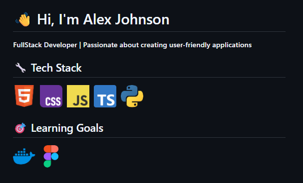
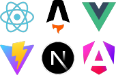

<p align="center"></p>
<p align="center"></p>

# ReadmePixel

**Generate custom skill images for your GitHub README with a single URL**

ReamePixel is a tool that lets developers generate customizable skill badges via a URL. Perfect for GitHub READMEs, it turns your tech stack into a visually appealing, professional image in seconds.



## 🛠️ Features

- **Tech Icons**: Built-in support for 700+ technologies powered by [svgl.app](https://svgl.app).
- **Customizable**: Choose which icons to display, their size, grid layout, and spacing.
- **Extensible**: Easily add more SVG icons to the `static/icons/` directory.

## 🚀 Installation

### 1. Fork the Repository:

Click the "Fork" button at the top-right of this repo.

### 2. Clone Your Fork:

```bash
git clone git@github.com:<your_username>/readmepixel.git 
cd readmepixel
```

### 3. Install dependencies:

```bash
pip install -r requirements.txt
```
### Run the server:

```bash
fastapi dev main.py
```

Visit [http://localhost:8000/skills](http://localhost:8000/skills) in your browser with desired query parameters.


## 📝 How to Use

Customize your skill image by modifying these optional parameters in the URL:

### 1. `icons` (Select Your Technologies)
Choose from 700+ tech icons (e.g., `html5`, `css`, `javascript`, `typescript`, `python`).

```
/skills?icons=html5,css,javascript,typescript,python
```


### 2. `per_lines` (Icons per Row)

Control how many icons appear per line.

```
/skills?icons=react_dark,astro,vue,vitejs,nextjs_icon_dark,angular&per_lines=3
```



### 3. `icon_size` (Icon Dimensions)

Adjust the size of each icon (default: 50).

```
/skills?icons=html5,css,javascript&icon_size=100
```


### 4. `spacing` (Space Between Icons)

Adjust the gap between icons (default: 10).

```
/skills?icons=html5,javascript&spacing=100
```


## How It Works

- SVG icons are loaded from `static/icons/` at startup.
- The `/skills` endpoint composes the requested icons into a grid, converts them to PNG, and returns the image.

## Adding New Icons

- Place new SVG files in the `static/icons/` directory.
- Use the icon's filename (without `.svg`) as the icon name in the API.

## 🙌 Credits & Acknowledgments

This project uses icons from **[svgl.app](https://svgl.app)**,  an amazing open-source collection of tech logos.  

## 📜 License

This project is licensed under the MIT License - See [MIT License](https://github.com/nsmichelj/readmepixel/blob/main/LICENSE) for details.
